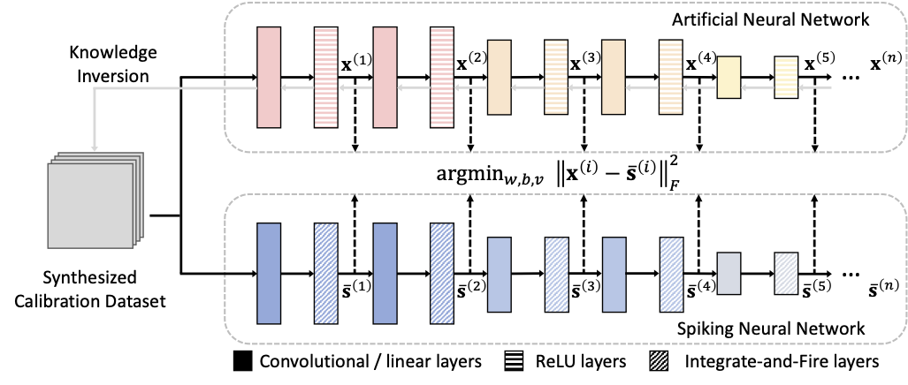
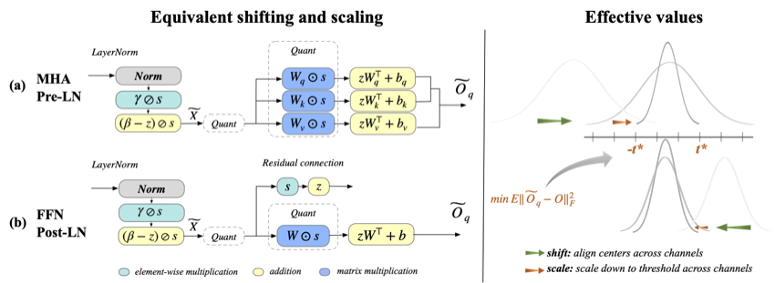
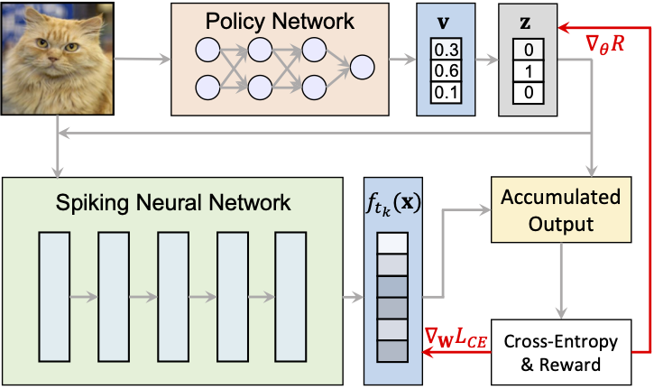
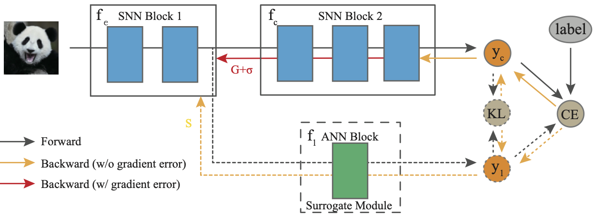
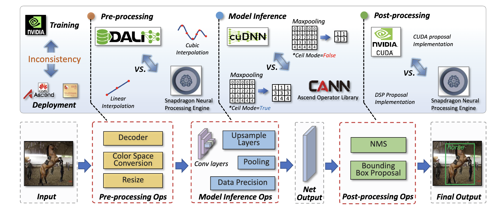
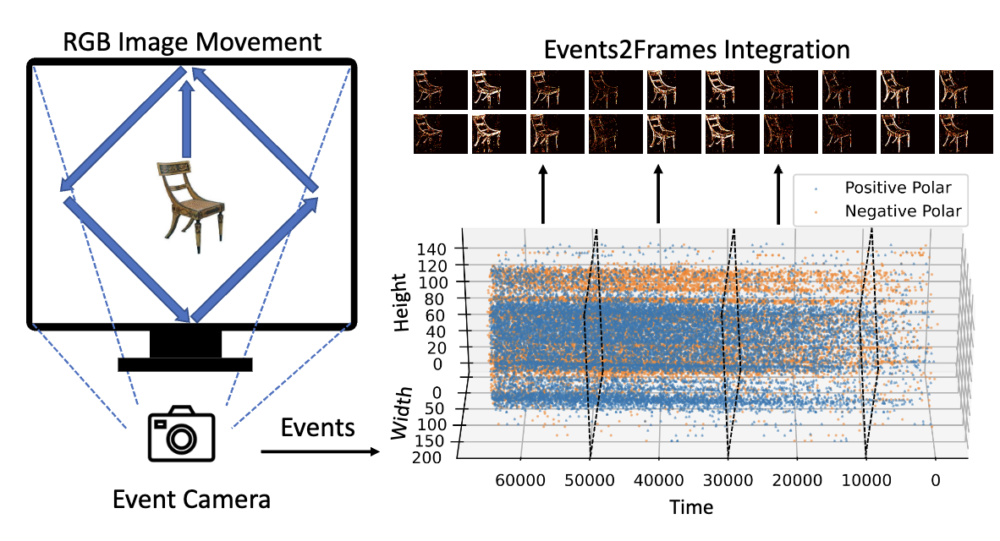
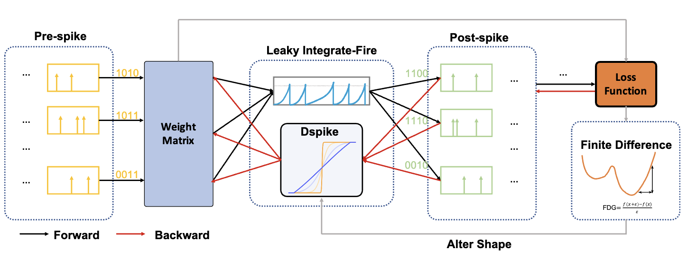
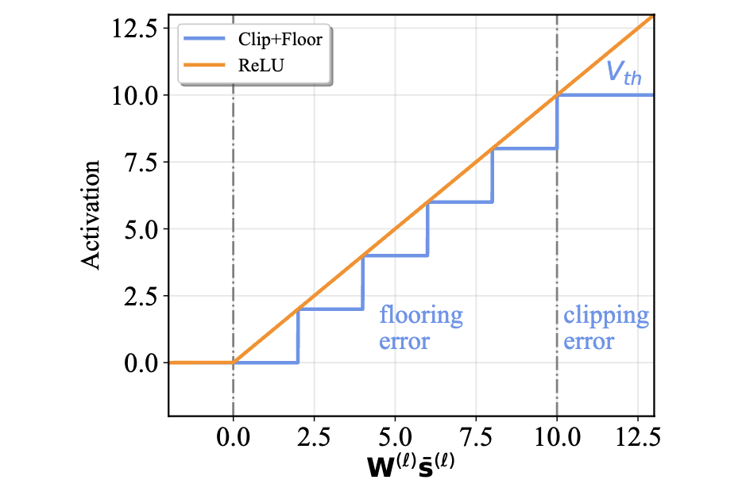
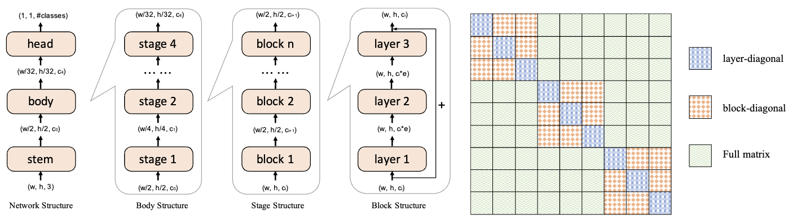
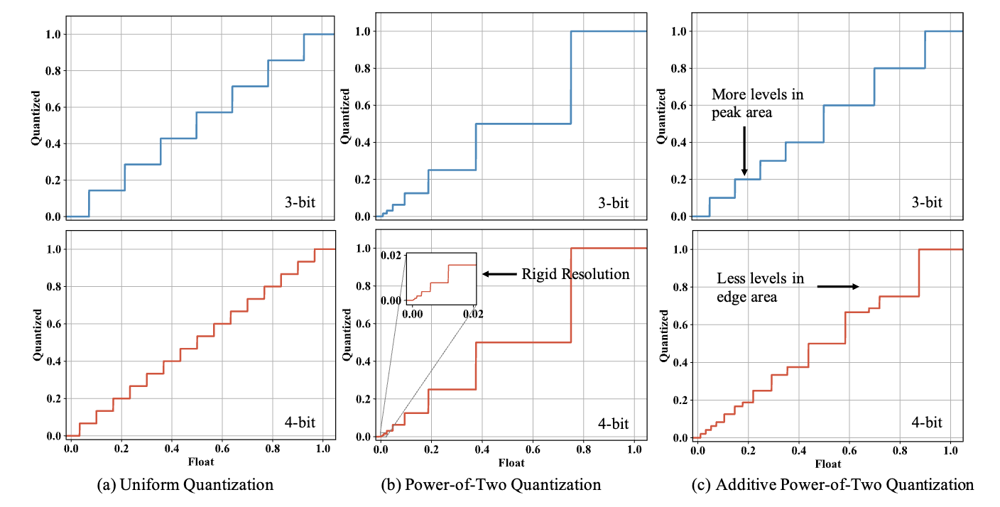

## About

I am a third-year Ph.D. candidate in the Electrical Engineering Department at Yale University. I am a member of [Intelligent Computing Lab](https://intelligentcomputinglab.yale.edu), advised by Prof. [Priya Panda](https://scholar.google.com/citations?user=qA5WsYUAAAAJ). 
My research interests include efficient deep learning models and systems and biology-inspired artificial intelligence. 
I have focused on neural network quantization for efficient inference, neuromorphic AI with spiking neural networks, and bio-plausible optimization methods. My research is applied to the lastest topics like Diffusion Models and Large Language Models. 

Prior to Yale, I graduated from UESTC in 2020. I did research assistant/internship at the National University of Singapore, SenseTime, and Amazon. I received the 2023 Baidu PhD Fellowship. 

## News

### 2024

- Apr:  I had a talk in CoCoSyS.
- Mar:  I passed my area exam and advanced to candidacy. 
- Feb:  A paper about ANN-SNN conversion has been accepted by IJCV. 
- Jan:  I received the 2023 Baidu PhD Fellowship (10 winners/year). 

### 2023

- Sep:  A paper about SNN with dynamic timesteps is accepted to NeurIPS 2023 and a paper about Post-Training Quantization in LLM is accepted to EMNLP 2023. 
- Aug:  I will serve as the Area Chair for EMNLP 2023. 
- May:  A paper about SNN with surrogate module learning is accepted to ICML 2024. 

## Selected Publications

 
   **Error-Aware Conversion from ANN to SNN via Post-training Parameter Calibration**  
   Authors: **Yuhang Li**, Shikuang Deng, Xin Dong, Shi Gu 
   *International Journal of Computer Vision (2024): 1-24.*  
   [Paper Link](https://link.springer.com/article/10.1007/s11263-024-02046-2)  
    

 
   **Outlier Suppression+: Accurate Quantization of Large Language Models by Equivalent and Optimal Shifting and Scaling**  
   Authors: Xiuying Wei, Yunchen Zhang, **Yuhang Li**, Xiangguo Zhang, Ruihao Gong, Jinyang Guo, Xianglong Liu
   *Conference on Empirical Methods in Natural Language Processing (2023).*  
   [Paper Link](https://arxiv.org/pdf/2304.09145)  
    

 
   **SEENN: Towards Temporal Spiking Early-Exit Neural Networks**  
   Authors: **Yuhang Li**, Tamar Geller, Youngeun Kim, Priyadarshini Panda
   *Conference on Neural Information Processing System (2023).*  
   [Paper Link](https://proceedings.neurips.cc/paper_files/paper/2023/file/c801e68207da477bbc44182b9fac1129-Paper-Conference.pdf)  
    

 
   **Surrogate Module Learning: Reduce the Gradient Error Accumulation in Training Spiking Neural Networks**  
   Authors: Shikuang Deng, Hao Lin, **Yuhang Li**, Shi Gu
   *International Conference on Machine Learning (2023).*  
   [Paper Link](https://proceedings.mlr.press/v202/deng23d/deng23d.pdf)  
    

 
   **SysNoise: Exploring and Benchmarking Training-Deployment System Inconsistency**  
   Authors: Yan Wang, **Yuhang Li**, Ruihao Gong, Aishan Liu, Jian Hu, Yongqiang Yao, Yunchen Zhang, Fengwei Yu, Xianglong Liu
   *Proceedings of Machine Learning and Systems (2023).*  
   [Paper Link](https://proceedings.mlsys.org/paper_files/paper/2023/file/842bb98e13307da899490002bf2c693f-Paper-mlsys2023.pdf)  
    

 
   **Neuromorphic Data Augmentation for Training Spiking Neural Networks**  
   Authors: **Yuhang Li**, Youngeun Kim, Hyoungseob Park, Tamar Geller, Priyadarshini Panda
   *European Conference on Computer Vision (2022).*  
   [Paper Link](https://arxiv.org/pdf/2203.06145)  
    

 
   **Differentiable spike: Rethinking gradient-descent for training spiking neural networks**  
   Authors: **Yuhang Li**, Yufei Guo, Shanghang Zhang, Shikuang Deng, Yongqing Hai, Shi Gu
   *Conference on Neural Information Processing System (2021).*  
   [Paper Link](https://proceedings.neurips.cc/paper/2021/file/c4ca4238a0b923820dcc509a6f75849b-Paper.pdf)  
    

 
   **A free lunch from ANN: Towards efficient, accurate spiking neural networks calibration**  
   Authors: **Yuhang Li**, Shikuang Deng, Xin Dong, Ruihao Gong, Shi Gu
   *International Conference on Machine Learning (2021).*  
   [Paper Link](https://proceedings.mlr.press/v139/li21d/li21d.pdf)  
    

 
   **Brecq: Pushing the limit of post-training quantization by block reconstruction**  
   Authors: **Yuhang Li**, Ruihao Gong, Xu Tan, Yang Yang, Peng Hu, Qi Zhang, Fengwei Yu, Wei Wang, Shi Gu
   *International Conference on Learning Representations (2021).*  
   [Paper Link](https://arxiv.org/pdf/2102.05426)  
    

 
   **Additive powers-of-two quantization: An efficient non-uniform discretization for neural networks**  
   Authors: **Yuhang Li**, Xin Dong, Wei Wang
   *International Conference on Learning Representations (2020).*  
   [Paper Link](https://arxiv.org/pdf/1909.13144)  
    
